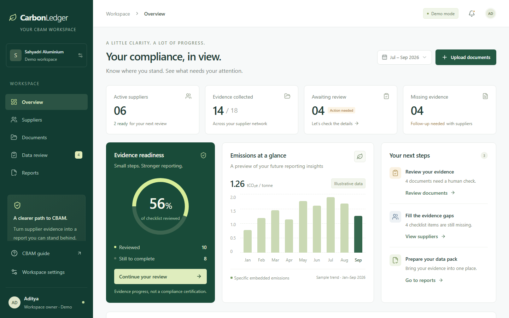
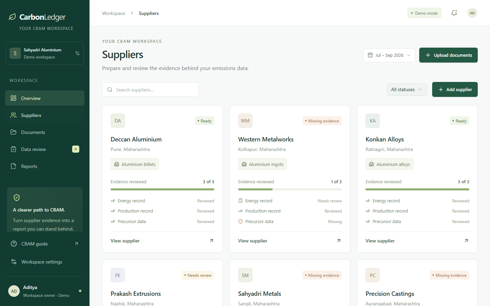
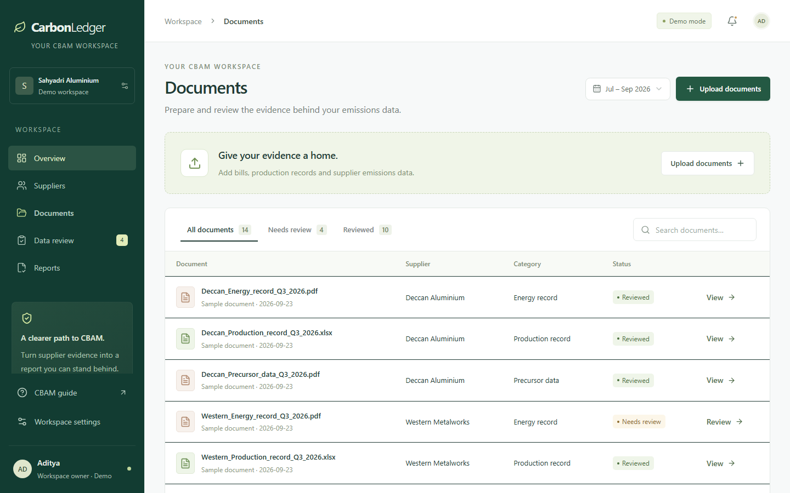

# CarbonLedger

A responsive CBAM evidence-preparation website for aluminium exporters. The public landing page explains the product, the interactive demo uses fictional suppliers, and a separate organisation workspace supports accounts, roles, and private source files once Supabase is connected.

[Visit the landing page](https://carbon-ledger-self.vercel.app) · [Open the interactive demo](https://carbon-ledger-self.vercel.app/workspace) · [Saved workspace](https://carbon-ledger-self.vercel.app/app)

## Interface preview

These screenshots show fictional demo data. The application prepares draft evidence; it does not certify CBAM compliance.

**Overview — evidence progress and next steps**



**Suppliers — evidence status for each supplier**



**Documents — the supplier evidence register**



## Run locally

Requires Node.js 22.13 or newer.

```sh
npm install
npm run dev
```

Open the local address printed by the server (normally `http://localhost:5173`).

```sh
npx tsc --noEmit --incremental false
node scripts/check-domain.mjs
npm run build
```

If Windows resolves `npm` incorrectly, invoke the installed npm CLI directly with Node. The site otherwise uses the standard project scripts.

For substantial changes, follow the [development quality workflow](AGENTS.md), based on a [pinned Unlazy revision](https://github.com/Leonxlnx/unlazy/tree/16671491f6679ad9378f52604d3bc2415b4120c7). It uses explicit acceptance gates and reviewed checks; it is not included in the production bundle.

## Implemented

- Overview with live evidence counts, checklist readiness, action links and an explicitly illustrative emissions chart.
- Supplier creation, search, status filtering, individual evidence checklists and downloadable request drafts.
- Multi-file upload and drag-and-drop, category and supplier selection, 10 MB file limits and filename-based duplicate checks within a supplier/period.
- PDF and image preview; spreadsheet originals can be downloaded for review in a spreadsheet application.
- Manual data entry, unit selection, source references, notes, confirmation before review, and draft saving.
- CSV evidence registers and escaped, printable HTML evidence packs, clearly marked as drafts and retaining sample labels.
- Working-period filtering, workspace-name settings, responsive navigation and accessible dialogs.
- Optional WebMCP read-summary and navigation tools that share the visible application state.

## Saved organisation workspace

The separate /app route supports email accounts, private organisations, team invitations, owner/admin/editor/viewer roles, supplier records, source-file uploads, document reviews, and a database-backed activity log. An invitation creates a link for an admin to share; the application does not send invitation emails. A recipient must sign in with the invited email to accept it.

This is implemented with Supabase Auth, Postgres row-level security, and a private Storage bucket. The browser uses only a publishable key. The database policies check membership and role for every organisation record and Storage object. Files are limited to 10 MB in the UI, table constraint, and bucket. The original file is downloaded through an authenticated request. The public demo remains separate and never writes its sample records to an organisation.

The saved route shows a clear setup state until the Supabase resource, environment variables, and migration are installed. It is not live merely because the frontend is deployed.

### Connect Supabase

1. Provision the [Supabase Vercel integration](https://vercel.com/marketplace/supabase) for the linked CarbonLedger project. The integration supplies NEXT_PUBLIC_SUPABASE_URL and NEXT_PUBLIC_SUPABASE_PUBLISHABLE_KEY to Vercel. Do not expose SUPABASE_SECRET_KEY or a service-role key in a NEXT_PUBLIC_ variable.
2. In the new Supabase project's SQL Editor, run [202609250001_workspaces.sql](supabase/migrations/202609250001_workspaces.sql) once. It creates the organisation tables, member-role checks, private org-evidence bucket, policies, and audit triggers. Do not use real documents until this migration succeeds.
3. In Supabase Auth URL settings, set the Site URL to the production site and allow https://carbon-ledger-self.vercel.app/app as a redirect. Keep email confirmation enabled, so only a verified address can accept an invitation. Configure custom SMTP before a team pilot; the default email sender is rate-limited.
4. Pull Vercel development environment variables into .env.local with vercel env pull .env.local --yes, or fill the two public values from [.env.example](.env.example). Rebuild and redeploy after adding Vercel variables because they are embedded into the browser bundle at build time.
5. Test with two confirmed accounts: create an organisation, invite the second email, accept the invitation, upload a document, review it, then verify a user outside the organisation cannot read its records or file.

The app does not yet provide password reset, automated email invitations, virus scanning, or a formal backup/retention policy. Add those before storing customer production evidence.

## Demo prototype boundaries

All changes and uploads are held in browser memory, only for the current page session. Refreshing or closing the tab resets the data. Files are not uploaded to a backend. The demo uses one manually entered value per document; this is not a complete CBAM data model.

Readiness measures three illustrative checklist categories for each supplier. It does not measure regulatory compliance. Working quarters organise evidence; they are not statutory filing periods. The chart is illustrative and never enters draft exports.

The demo does not use the saved account or storage. Neither route implements OCR/AI extraction, a methodology-specific emissions engine, accredited verification or EU registry submission. Exported demo HTML lists source references but does not embed original files. No email is sent by the application.

## Structure

- `app/page.tsx` and `app/landing.css`: public product landing page, responsive styling and visual storytelling.
- `app/workspace/page.tsx`: shared demo session state, dashboard and navigation.
- `components/landing-motion.tsx`: progressive scroll reveals and mobile navigation behavior.
- `components/workspace-views.tsx`: suppliers, documents, review dialogs, reports and settings.
- `lib/workspace.ts`: typed records and sample fixtures.
- `lib/reports.ts`: evidence checklist and safe draft exports.
- `lib/use-workspace-tools.ts`: optional WebMCP integration.
- [Saved workspace](app/app/page.tsx) and [browser data client](lib/supabase-rest.ts): signed-in organisation flow.
- [Supabase migration](supabase/migrations/202609250001_workspaces.sql): role, row-level security, private Storage and audit schema.
- `app/globals.css`: responsive theme and application styles.
- `public/images`: optimized, illustrative industrial imagery and workspace previews for the landing page.

Built with React and TypeScript. The local preview uses the original Vinext development setup. Vercel uses a standard Next.js static export through npm run build:vercel, configured in vercel.json. The saved route connects directly to Supabase with authenticated requests; Supabase enforces access in the database and private Storage. The legacy Sites identity is retained locally in .openai/hosting.json and excluded from Vercel uploads.

## Deploy to Vercel

The project is linked to `adi29ms-projects/carbon-ledger` through the ignored `.vercel/project.json`.

```sh
npm run build:vercel
vercel deploy --prod
```

The static deployment alone does not enable accounts or storage. Connect Supabase and run the migration before using /app. Local environment files and development artifacts are excluded using .vercelignore.

## Next implementation phase

Add document extraction with source-location references, password recovery and operational safeguards for a team pilot. Implement emissions calculations only after the product-specific methodology and data requirements have been reviewed with a CBAM specialist.
